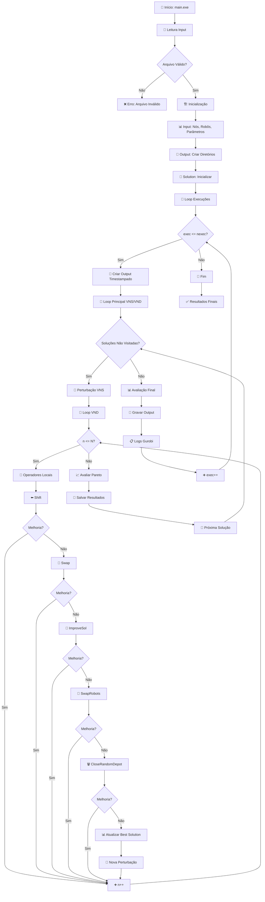
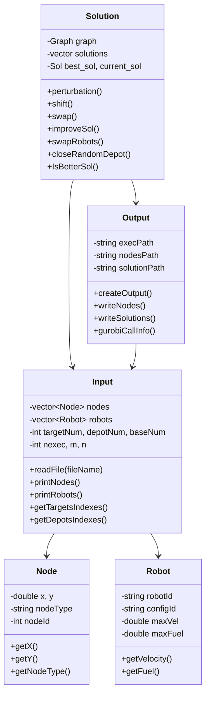
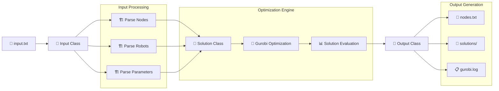
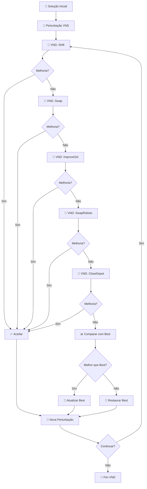

# Diagrama de Fluxo - matUAVs

## Fluxograma Principal

```mermaid
flowchart TD
    A[📁 Início: main.exe] --> B[📖 Leitura Input]
    B --> C{Arquivo Válido?}
    C -->|Não| D[❌ Erro: Arquivo Inválido]
    C -->|Sim| E[🏗️ Inicialização]
    
    E --> F[📊 Input: Nós, Robôs, Parâmetros]
    F --> G[📁 Output: Criar Diretórios]
    G --> H[🎯 Solution: Inicializar]
    
    H --> I[🔄 Loop Execuções]
    I --> J{exec <= nexec?}
    J -->|Não| Z[🏁 Fim]
    J -->|Sim| K[📅 Criar Output Timestampado]
    
    K --> L[🔄 Loop Principal VNS/VND]
    L --> M{Soluções Não Visitadas?}
    M -->|Não| N[📊 Avaliação Final]
    M -->|Sim| O[🎲 Perturbação VNS]
    
    O --> P[🔄 Loop VND]
    P --> Q{n <= N?}
    Q -->|Não| R[📈 Avaliar Pareto]
    Q -->|Sim| S[🔧 Operadores Locais]
    
    S --> T[⬅️ Shift]
    T --> U{Melhoria?}
    U -->|Sim| V[➕ n++]
    U -->|Não| W[🔄 Swap]
    
    W --> X{Melhoria?}
    X -->|Sim| V
    X -->|Não| Y[🔧 ImproveSol]
    
    Y --> AA{Melhoria?}
    AA -->|Sim| V
    AA -->|Não| BB[🔄 SwapRobots]
    
    BB --> CC{Melhoria?}
    CC -->|Sim| V
    CC -->|Não| DD[🗑️ CloseRandomDepot]
    
    DD --> EE{Melhoria?}
    EE -->|Sim| V
    EE -->|Não| FF[📊 Atualizar Best Solution]
    
    FF --> GG[🎲 Nova Perturbação]
    GG --> V
    V --> Q
    
    R --> HH[📝 Salvar Resultados]
    HH --> II[🔄 Próxima Solução]
    II --> M
    
    N --> JJ[💾 Gravar Output]
    JJ --> KK[📋 Logs Gurobi]
    KK --> LL[➕ exec++]
    LL --> J
    
    Z --> MM[✅ Resultados Finais]
```

## Diagrama de Classes Principais

```mermaid
classDiagram
    class Input {
        -vector~Node~ nodes
        -vector~Robot~ robots
        -int targetNum, depotNum, baseNum
        -int nexec, m, n
        +readFile(fileName)
        +printNodes()
        +printRobots()
        +getTargetsIndexes()
        +getDepotsIndexes()
    }
    
    class Solution {
        -Graph graph
        -vector solutions
        -Sol best_sol, current_sol
        +perturbation()
        +shift()
        +swap()
        +improveSol()
        +swapRobots()
        +closeRandomDepot()
        +IsBetterSol()
    }
    
    class Output {
        -string execPath
        -string nodesPath
        -string solutionPath
        +createOutput()
        +writeNodes()
        +writeSolutions()
        +gurobiCallInfo()
    }
    
    class Node {
        -double x, y
        -string nodeType
        -int nodeId
        +getX()
        +getY()
        +getNodeType()
    }
    
    class Robot {
        -string robotId
        -string configId
        -double maxVel
        -double maxFuel
        +getVelocity()
        +getFuel()
    }
    
    Input --> Node
    Input --> Robot
    Solution --> Input
    Output --> Input
    Solution --> Output
```

## Fluxo de Dados

```mermaid
flowchart LR
    A[📄 input.txt] --> B[📖 Input Class]
    B --> C[🏗️ Parse Nodes]
    B --> D[🏗️ Parse Robots]
    B --> E[🏗️ Parse Parameters]
    
    C --> F[🎯 Solution Class]
    D --> F
    E --> F
    
    F --> G[🧮 Gurobi Optimization]
    G --> H[📊 Solution Evaluation]
    H --> I[📁 Output Class]
    
    I --> J[📄 nodes.txt]
    I --> K[📁 solutions/]
    I --> L[📋 gurobi.log]
    
    subgraph "Input Processing"
        C
        D
        E
    end
    
    subgraph "Optimization Engine"
        F
        G
        H
    end
    
    subgraph "Output Generation"
        J
        K
        L
    end
```

## Ciclo VNS/VND Detalhado

```mermaid
flowchart TD
    A[🎯 Solução Inicial] --> B[🎲 Perturbação VNS]
    B --> C[🔧 VND: Shift]
    C --> D{Melhoria?}
    D -->|Sim| E[✅ Aceitar]
    D -->|Não| F[🔧 VND: Swap]
    
    F --> G{Melhoria?}
    G -->|Sim| E
    G -->|Não| H[🔧 VND: ImproveSol]
    
    H --> I{Melhoria?}
    I -->|Sim| E
    I -->|Não| J[🔧 VND: SwapRobots]
    
    J --> K{Melhoria?}
    K -->|Sim| E
    K -->|Não| L[🔧 VND: CloseDepot]
    
    L --> M{Melhoria?}
    M -->|Sim| E
    M -->|Não| N[📊 Comparar com Best]
    
    N --> O{Melhor que Best?}
    O -->|Sim| P[🔄 Atualizar Best]
    O -->|Não| Q[🔄 Restaurar Best]
    
    P --> R[🎲 Nova Perturbação]
    Q --> R
    E --> R
    R --> S{Continuar?}
    S -->|Sim| C
    S -->|Não| T[🏁 Fim VND]
```