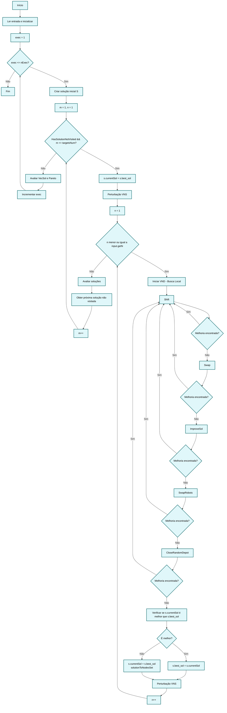

# Diagrama de Fluxo - Algoritmo MHCP (VNS/VND)

## Fluxo Principal do Algoritmo



## Comportamento Real dos Operadores Locais (VND)

### Sequência de Execução:
1. **Shift** → Se encontrar melhoria, **retorna ao Shift**
2. **Swap** → Se encontrar melhoria, **retorna ao Shift** 
3. **ImproveSol** → Se encontrar melhoria, **retorna ao Shift**
4. **SwapRobots** → Se encontrar melhoria, **retorna ao Shift**
5. **CloseRandomDepot** → Se encontrar melhoria, **retorna ao Shift**

### Comportamento Chave:
- **Quando um operador encontra melhoria**: O algoritmo executa `continue`, que reinicia o ciclo VND desde o primeiro operador (Shift)
- **Apenas quando NENHUM operador encontra melhoria**: O algoritmo incrementa `n` e aplica uma nova perturbação VNS

### Código Correspondente (src/MHCP.cpp, linhas 104-185):
```cpp
while(n <= input.getN()){
    // VND - Variable Neighborhood Descent
    if(s.shift(&s.currentSol)){
        continue;  // ← RETORNA AO INÍCIO DO LOOP (linha 104)
    }
    
    if(s.swap(&s.currentSol)){
        continue;  // ← RETORNA AO INÍCIO DO LOOP (linha 104)
    }
    
    if(s.improveSol(&s.currentSol)){
        continue;  // ← RETORNA AO INÍCIO DO LOOP (linha 104)
    }
    
    if(s.swapRobots(&s.currentSol)){
        continue;  // ← RETORNA AO INÍCIO DO LOOP (linha 104)
    }
    
    if(s.closeRandomDepot(&s.currentSol)){
        continue;  // ← RETORNA AO INÍCIO DO LOOP (linha 104)
    }
    
    // Só chega aqui se NENHUM operador encontrou melhoria
    // Atualiza melhor solução e aplica nova perturbação
    if(s.IsBetterSol(s.currentSol,s.best_sol))
        s.best_sol = s.currentSol;
    else{
        s.currentSol = s.best_sol;
        s.solutionToNodesSet(s.best_sol);
    }
    
    s.perturbation(&s.currentSol,maxDepots);
    n++;  // ← INCREMENTA APENAS QUANDO NÃO HÁ MELHORIAS
}
```

## Diferença em Relação ao Comportamento Inicialmente Descrito

### Comportamento Inicial (Incorreto):
- Aplicar operador → Se encontrar melhoria, incrementar `n` e ir para próximo operador
- Cada operador seria testado apenas uma vez por iteração

### Comportamento Real (Correto):
- Aplicar operador → Se encontrar melhoria, **voltar ao primeiro operador**
- Cada operador é reaplicado **até esgotar todas as melhorias possíveis**
- Só incrementa `n` quando **nenhum** operador consegue mais melhorias

Este comportamento implementa uma estratégia de **intensificação local mais agressiva**, onde cada tipo de movimento é explorado até a exaustão antes de passar para outros tipos de movimento ou aplicar novas perturbações.

