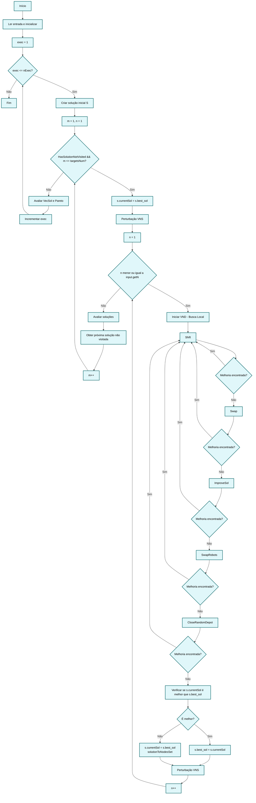

# Diagrama de Fluxo - Algoritmo MHCP (VNS/VND)

## Nota sobre Multiplataforma

Este fluxo é válido para **Windows (x64)** e **Linux (x64)**. O algoritmo implementado em C++17 é idêntico em ambas as plataformas, alterando apenas:
- O executável gerado (`main.exe` no Windows, `main` no Linux)
- O processo de build (MSVC no Windows, GCC/Clang no Linux)
- Configuração de bibliotecas do Gurobi

O código-fonte e a lógica do algoritmo são 100% compatíveis entre plataformas.

---

## Fluxo Principal do Algoritmo



## Comportamento Real dos Operadores Locais (VND)

### Sequência de Execução:
1. **Shift** → Se encontrar melhoria, **retorna ao Shift**
2. **Swap** → Se encontrar melhoria, **retorna ao Shift** 
3. **ImproveSol** → Se encontrar melhoria, **retorna ao Shift**
4. **SwapRobots** → Se encontrar melhoria, **retorna ao Shift**
5. **CloseRandomDepot** → Se encontrar melhoria, **retorna ao Shift**

### Comportamento Chave:
- **Quando um operador encontra melhoria**: O algoritmo executa `continue`, que reinicia o ciclo VND desde o primeiro operador (Shift)
- **Apenas quando NENHUM operador encontra melhoria**: O algoritmo incrementa `n` e aplica uma nova perturbação VNS

### Código Correspondente (src/MHCP.cpp, linhas 104-185):
```cpp
while(n <= input.getN()){
    // VND - Variable Neighborhood Descent
    if(s.shift(&s.currentSol)){
        continue;  // ← RETORNA AO INÍCIO DO LOOP (linha 104)
    }
    
    if(s.swap(&s.currentSol)){
        continue;  // ← RETORNA AO INÍCIO DO LOOP (linha 104)
    }
    
    if(s.improveSol(&s.currentSol)){
        continue;  // ← RETORNA AO INÍCIO DO LOOP (linha 104)
    }
    
    if(s.swapRobots(&s.currentSol)){
        continue;  // ← RETORNA AO INÍCIO DO LOOP (linha 104)
    }
    
    if(s.closeRandomDepot(&s.currentSol)){
        continue;  // ← RETORNA AO INÍCIO DO LOOP (linha 104)
    }
    
    // Só chega aqui se NENHUM operador encontrou melhoria
    // Atualiza melhor solução e aplica nova perturbação
    if(s.IsBetterSol(s.currentSol,s.best_sol))
        s.best_sol = s.currentSol;
    else{
        s.currentSol = s.best_sol;
        s.solutionToNodesSet(s.best_sol);
    }
    
    s.perturbation(&s.currentSol,maxDepots);
    n++;  // ← INCREMENTA APENAS QUANDO NÃO HÁ MELHORIAS
}
```

## Diferença em Relação ao Comportamento Inicialmente Descrito

### Comportamento Inicial (Incorreto):
- Aplicar operador → Se encontrar melhoria, incrementar `n` e ir para próximo operador
- Cada operador seria testado apenas uma vez por iteração

### Comportamento Real (Correto):
- Aplicar operador → Se encontrar melhoria, **voltar ao primeiro operador**
- Cada operador é reaplicado **até esgotar todas as melhorias possíveis**
- Só incrementa `n` quando **nenhum** operador consegue mais melhorias

Este comportamento implementa uma estratégia de **intensificação local mais agressiva**, onde cada tipo de movimento é explorado até a exaustão antes de passar para outros tipos de movimento ou aplicar novas perturbações.

---

## Fluxo de Build Multiplataforma

### Etapas Comuns (Windows e Linux)

1. **Limpeza de artefatos antigos**
   - Remove executáveis e objetos compilados anteriormente
   - Prepara ambiente limpo para novo build

2. **Preparação de diretórios**
   - Cria `bin/` para executáveis
   - Cria `logs/` para logs do Gurobi
   - Usa `std::filesystem` (C++17) para compatibilidade

3. **Configuração do Gurobi**
   - **Windows**: `C:\gurobi1202\win64` (padrão)
   - **Linux**: `/opt/gurobi1202/linux64` (padrão)
   - Paths podem ser customizados via `GUROBI_HOME`

4. **Compilação dos arquivos-fonte** (9 arquivos)
   - Configuration.cpp
   - Graph.cpp
   - Input.cpp
   - MHCP.cpp (contém main)
   - Node.cpp
   - Output.cpp
   - Rand.cpp
   - Robot.cpp
   - Solution.cpp

5. **Linkagem com Gurobi**
   - **Windows**: `gurobi_c++mt2017.lib` + `gurobi120.lib`
   - **Linux**: `libgurobi_c++.a` + `libgurobi120.so` + `pthread` + `m`

6. **Geração do executável**
   - **Windows**: `build/bin/Release/matUAVs.exe` (ou `Debug/matUAVs.exe`)
   - **Linux**: `build/bin/matUAVs`

7. **Logs e organização**
   - Logs do Gurobi gerados durante execução em `logs/` com timestamp
   - Estrutura de build consistente via CMake

### Etapas Específicas por Plataforma

#### Windows (MSVC)
- CMake detecta ambiente MSVC automaticamente
- Flags configuradas via CMake: `/EHsc` (exceções), `/std:c++17`, `/W3`
- Build via VS Code: `Ctrl+Shift+B` ou via CMake diretamente
- Gera executável em `build/bin/Release/matUAVs.exe`

#### Linux (GCC/Clang)
- Flags configuradas via CMake: `-std=c++17`, `-Wall -Wextra`, `-O2/-O3`
- Build via CMake: `cmake .. && make -j$(nproc)`
- Requer configuração de `LD_LIBRARY_PATH` para Gurobi
- Linkagem explícita com `-lpthread -lm` gerenciada pelo CMake
- Gera executável em `build/bin/matUAVs`

### Diagrama de Build Simplificado

```
┌─────────────────────────────────────────┐
│   Código-fonte C++17 (multiplataforma)  │
└──────────────┬──────────────────────────┘
               │
       ┌───────┴───────┐
       │               │
┌──────▼──────┐  ┌────▼─────┐
│   Windows   │  │  Linux   │
│    MSVC     │  │ GCC/Clang│
└──────┬──────┘  └────┬─────┘
       │               │
       │  Compilação  │
       │   C++17      │
       │               │
┌──────▼──────┐  ┌────▼─────┐
│ Gurobi libs │  │Gurobi libs│
│   (.lib)    │  │ (.so/.a)  │
└──────┬──────┘  └────┬─────┘
       │               │
       │  Linkagem    │
       │               │
┌──────▼──────┐  ┌────▼─────┐
│build/bin/   │  │build/bin/│
│matUAVs.exe  │  │matUAVs   │
└─────────────┘  └──────────┘
       │               │
       └───────┬───────┘
               │
      ┌────────▼─────────┐
      │   Execução       │
      │   (idêntica)     │
      └──────────────────┘
               │
      ┌────────▼─────────┐
      │  output/ + logs/ │
      │  (multiplataforma)│
      └──────────────────┘
```

---

## Pontos de Atenção Multiplataforma

### Compatibilidade Total
- ✅ Código-fonte C++ (100% padrão C++17)
- ✅ Arquivos de entrada/saída
- ✅ Estrutura de diretórios (`std::filesystem`)
- ✅ Lógica do algoritmo VNS/VND
- ✅ Integração com Gurobi

### Diferenças Gerenciadas
- ⚙️ Nome do executável (`main.exe` vs `main`)
- ⚙️ Bibliotecas Gurobi (`.lib` vs `.so/.a`)
- ⚙️ Flags de compilação (MSVC vs GCC/Clang)
- ⚙️ Variáveis de ambiente Linux (`LD_LIBRARY_PATH`)

### Arquivos de Saída
- 📁 Estrutura de `output/` idêntica
- 📁 Logs do Gurobi com mesmo formato
- 📁 Separadores de caminho normalizados por `std::filesystem`

---

